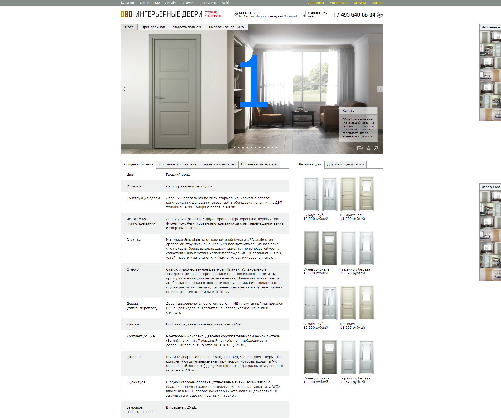

Doors
=====
# Макет главной страницы сайта "dveri.ru"

Заказчик прислал макет главной страницы в PSD, по этому макету сделал вёрстку

### [Главная страница](http://enrikolabriko.github.io/doors/index.html "Главная страница")

